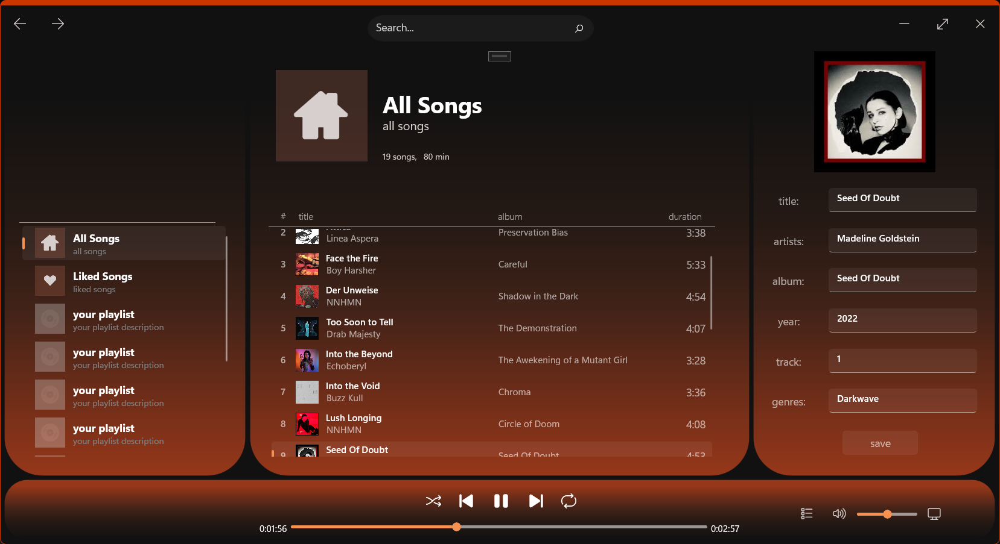

# Kith Music Player

**Kith** is a modern desktop music player and metadata editor built for Windows using the WinUI 3 (Windows App SDK) framework. It features a sleek, "Mica-infused" interface offering a fluid user experience for managing local music libraries.

## Features
- Local Library Management: Automatically scans and indexes MP3 files from your local music directory.
- Advanced Metadata Editor: Built-in support for editing ID3 tags (Title, Artist, Album, Year, Track, Album Cover and Genres) using the **TagLib#** library.
- Custom Album Art: Update and embed new album covers directly into your music files by tapping the current artwork.
- Dynamic Playlists (Collections): Organize your music into collections, including a default "All Songs" view and a "Liked Songs" section.
- Modern Audio Controls: Complete transport controls including seek, volume, mute, and shuffle/repeat functionality.

## Structure
- Converters: Custom XAML value converters (DurationConverter, IPictureImageConverter, StringJoinConverter) to handle data formatting.
- Sources: The core logic and ViewModels (SongView.cs, CollectionView.cs) following an MVVM-inspired pattern.
- Assets: Houses application icons, fonts and static images.
- App.xaml: Defines the global theme (Dark Mode) and reusable styles for the elements.

## Tech Stack
- Framework: WinUI 3 (Windows App SDK)
- Language: C# / XAML
- Metadata Engine: TagLib#
- Platform: Windows 10/11 (Desktop)

## Roadmap
- Finishing all base features and perfecting the UI
- Full screen mode with dynamic animations based on the album cover art
- Integrated CD burning function with the ability to directly and quickly burn already made playlists

## Gallery
Main window (current progress)

