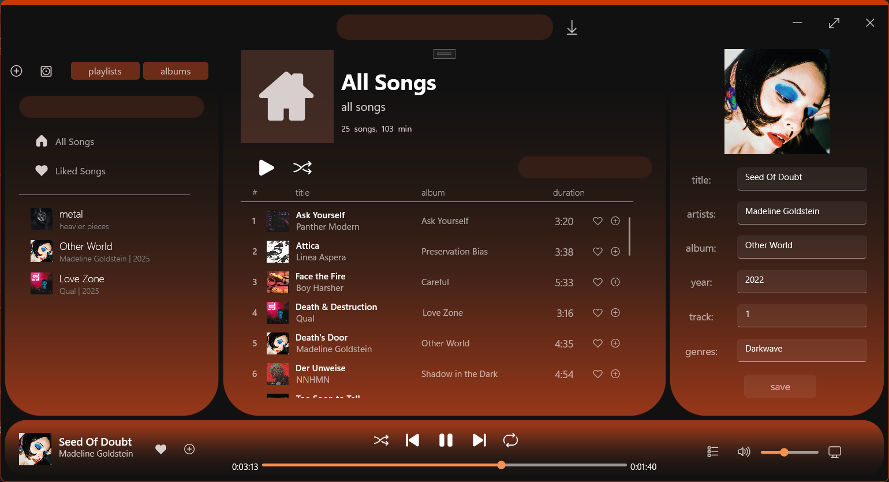
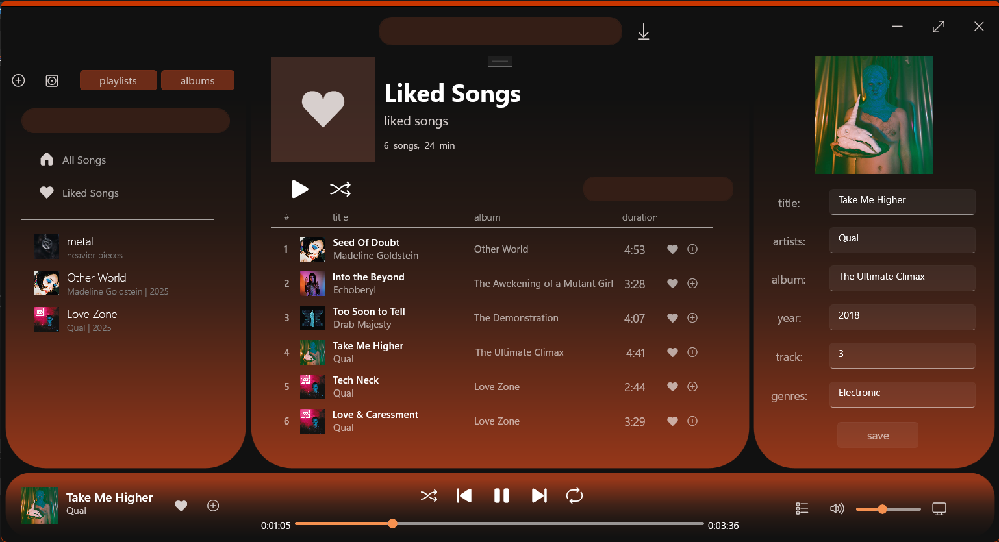
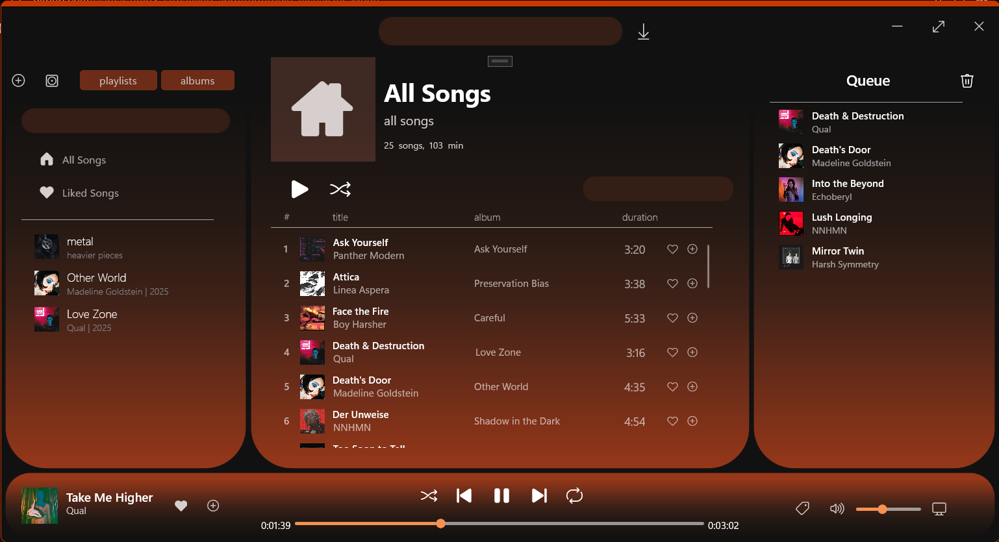
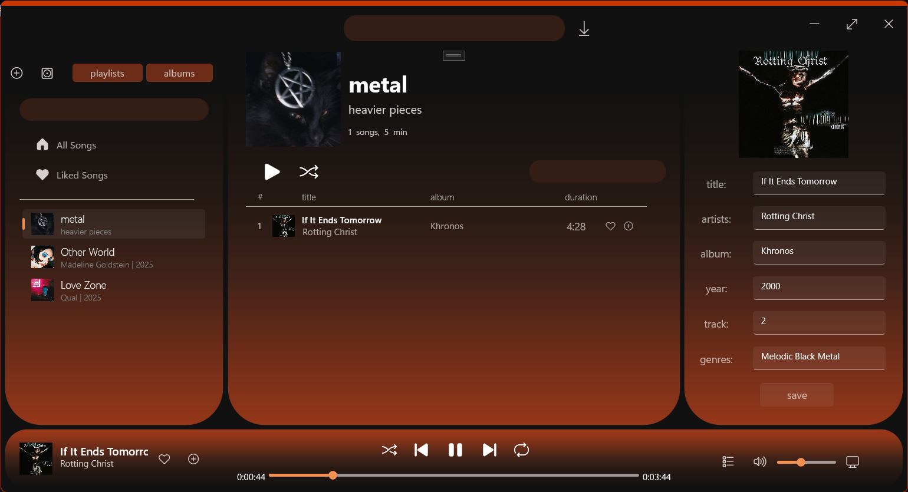
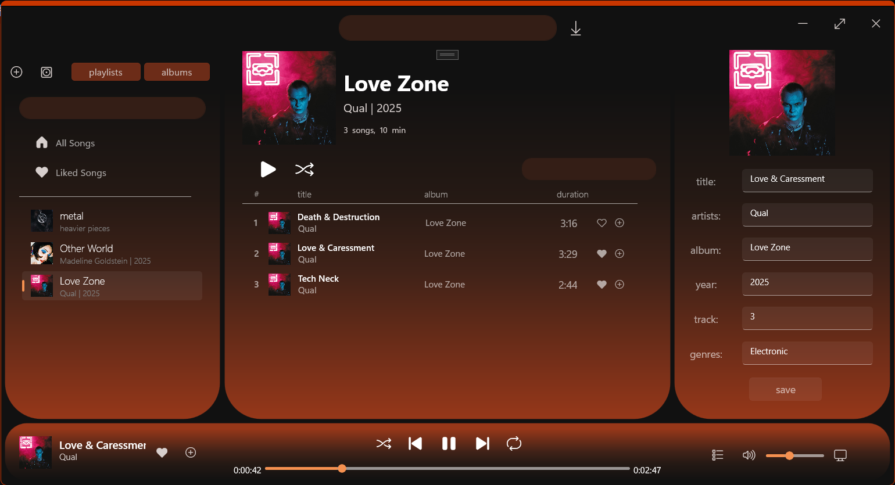
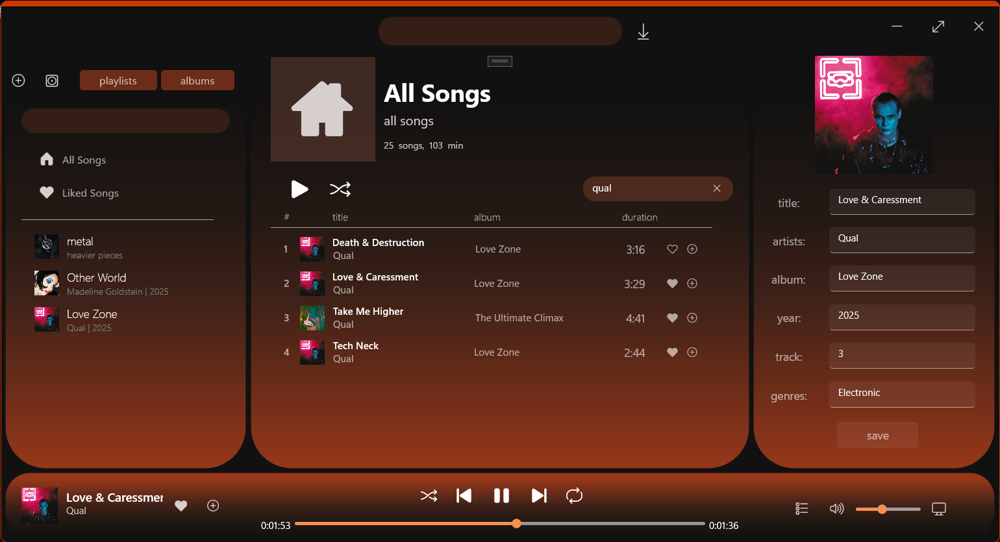
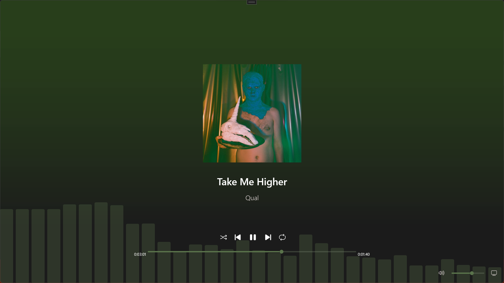

# Kith Music Player

**Kith** is a modern desktop music player and metadata editor built for Windows using the WinUI 3 (Windows App SDK) framework. It features a simple, not overcrowded modern interface offering a fluid user experience for managing local music libraries and tags. It focuses on simplicity and functionality so the interface stays clean as well as quick and easy to navigate.

## Features
- Local Library Management: Automatically scans and indexes MP3 files from your local music directory.
- Advanced Metadata Editor: Built-in support for editing ID3 tags (Title, Artist, Album, Year, Track, Album Cover and Genres) using the **TagLib#** library.
- Custom Album Art: Update and embed new album covers directly into your music files by tapping the current artwork.
- Dynamic Playlists (Collections): Organize your music into collections, including a default "All Songs" view and a "Liked Songs" section.
- Dynamic Albums: automatic grouping (triggered by a button) of songs into albums, if there are more than 1 song of an album -> create an album and automatically fill
  out name description and cover
- Modern Audio Controls with a true random shuffle (not like spotify) : Complete transport controls including seek, volume, mute, and shuffle/repeat functionality.
- Fully functional queue
- Saving application state between sessions
- Downloading mp3 files from youtube by link
- Focus mode with dynamic color based on the album cover
- Quality of life features like search boxes and filters

## Structure
- Converters: Custom XAML value converters (DurationConverter, IPictureImageConverter, StringJoinConverter) to handle data formatting.
- Sources: The core logic and ViewModels (SongView.cs, CollectionView.cs) following an MVVM pattern.
- Assets: Houses application icons, fonts and static images.
- App.xaml: Defines the global theme (Dark Mode) and reusable styles for the elements.

## Tech Stack
- Framework: WinUI 3 (Windows App SDK)
- Language: C# / XAML
- Metadata Engine: TagLib#
- Platform: Windows 10/11 (Desktop)

## Roadmap
- add dynamic animations based on the album cover art to focus mode
- Integrated CD burning function with the ability to directly and quickly burn already made playlists

## Gallery
Main window
                   
Main window with liked songs collection open         
              
Main window with queue tab open               
              
Main window with example playlists and one playlist open           
        
Main window with album grouping open                        
       
Main window with song search bar used                        
             
Focus mode open                          
               
